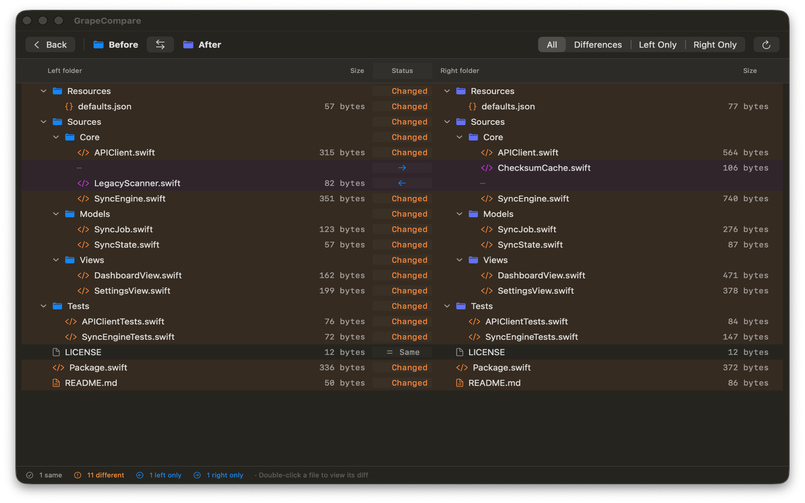
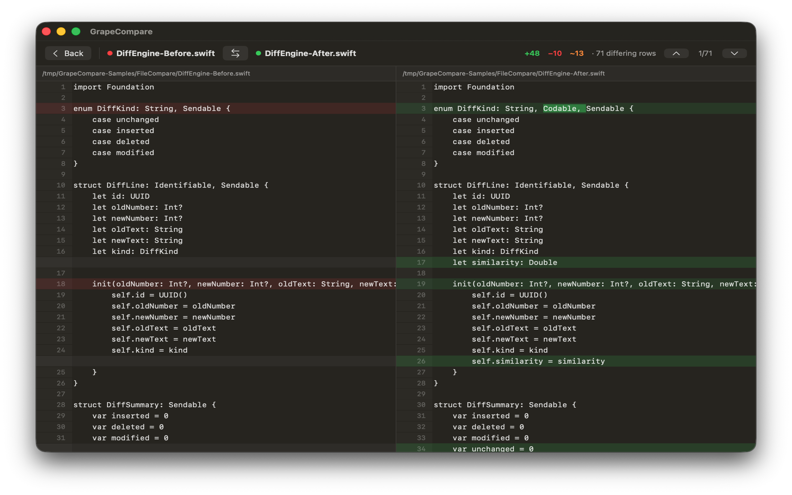

<div align="center">
  

# GrapeCompare

Repository: <https://github.com/everettjf/grapecompare>

[](https://discord.gg/eGzEaP6TzR)

**Fast, accurate file and folder comparison for macOS.**<br>
A native SwiftUI app inspired by Beyond Compare — no WebView, no cloud upload.

[](https://github.com/everettjf/GrapeCompare/releases/latest)
[](https://github.com/everettjf/GrapeCompare/actions/workflows/ci.yml)


[Homebrew](#install) · [Website](https://xnu.app/grapecompare/) · [中文说明](README.zh-CN.md) · [Changelog](CHANGELOG.md) · [Contributing](CONTRIBUTING.md)

</div>

## See every difference clearly

### Folder comparison

Browse a recursive, filterable tree and jump directly from a changed file into its text diff.

<p align="center">
  
</p>

### File comparison

Review aligned lines, character-level edits, totals, and previous/next difference navigation side by side.

<p align="center">
  
</p>

## Why GrapeCompare

- **Accurate:** byte-exact folder validation, shortest edit scripts for normal changes, visible final-newline differences, and correct handling of symbolic links, packages, and file/folder conflicts.
- **Fast at scale:** 100,000-line text comparisons complete in about 0.06 seconds; a 10,000-file folder benchmark completes in about 0.38 seconds on the development machine.
- **Easy to read:** side-by-side lines, character-level highlights, aligned line numbers, difference counts, and previous/next navigation.
- **Native and private:** a responsive macOS interface, local-only processing, and sandboxed read/write access limited to folders you explicitly select.

## Features

### File comparison

- Adaptive Myers line diff with low-occurrence anchors for large rewrites
- Character-level highlighting inside modified lines
- Search and line navigation, comparison rules, syntax colors, and optional line wrapping
- Hunk-level left/right acceptance, editable output, and unified diff/patch export
- Added, removed, and modified counts with keyboard-friendly navigation
- CRLF/LF normalization, final-newline reporting, and binary-file detection
- Memory-mapped input to avoid duplicating large files in memory

### Merge and developer workflows

- Three-way base/ours/theirs merge with explicit conflict resolution
- Branch, commit, index, and working-tree comparison without changing repository state
- Standalone CLI plus Git difftool/mergetool configuration
- Finder Quick Action support through the built-in Compare Files shortcut

### Images and structured data

- Image side-by-side, opacity overlay, dimensions, pixel metrics, and difference heatmap
- Semantic JSON and plist comparison with stable paths and object-key-order independence

### Folder comparison

- Recursive expandable tree with **Same**, **Different**, **Left Only**, and **Right Only** states
- All/Differences/Left Only/Right Only filters with automatic expansion of changed folders
- Type and size prechecks followed by exact, bounded-parallel byte validation
- Correct traversal of package directories and comparison of symbolic-link targets
- Fast subtree filtering through pre-aggregated status indexes
- Per-item and multi-row **Left → Right / Right → Left** operation planning
- Preflight review with real item/byte counts, overwrite warnings, progress, cancellation, and per-item results
- Safe copy, backup-before-replace, destination-empty move, and recoverable **Move to Trash**
- Durable undo history with changed-output protection, including across app relaunches; cross-volume moves are copied and byte-verified before the source enters Trash
- Explicit stop/continue failure policies plus transfer speed and estimated remaining time during execution
- Import/export of safe `.grapeplan` recipes that remap validated relative operations to the current folder pair

The contracts and acceptance criteria are documented in [the v1.3 safe-operations plan](docs/v1.3-safe-operations.md), [the v1.4 durable-workflows plan](docs/v1.4-durable-workflows.md), [the v1.5 text-actions plan](docs/v1.5-text-actions.md), and [the v1.6–v1.8 integration contract](docs/v1.6-v1.8-integration.md).

## Performance

The repository includes a Release benchmark with reproducible generated fixtures. Representative results from the development machine:

| Scenario | Result | Notes |
| --- | ---: | --- |
| 100k-line sparse edit | **0.060 s** | End-to-end: split, diff, inline ranges, rows |
| 30k-line high churn | **0.070 s** | Retains all stable structural anchors |
| 10k-file folder | **0.382 s** | Down from 2.385 s, about **6.2× faster** |
| 50k-file folder | **3.917 s** | Full scan, validation, tree, sort, rollup |

Timings exclude fixture generation and vary by hardware and storage. Run them locally:

```bash
bash macos/Benchmarks/run-benchmarks.sh
bash macos/Benchmarks/run-benchmarks.sh 100000 50000
```

The diff design builds on [Myers' O(ND) algorithm](https://doi.org/10.1007/BF01840446) and the low-occurrence anchoring ideas documented in [Git's diff algorithms](https://git-scm.com/docs/diff-algorithm-option.html).

## Install

Install the signed and notarized direct-distribution build with Homebrew:

```bash
brew install --cask everettjf/tap/grapecompare
```

GrapeCompare supports macOS 15 and later. To build from source, use Xcode 26 or later:

```bash
xcodebuild -project macos/GrapeCompare.xcodeproj \
  -scheme GrapeCompare \
  -destination 'platform=macOS' \
  -configuration Debug build
```

You can also open `macos/GrapeCompare.xcodeproj` in Xcode and press Run.

## Command line

```bash
bash macos/CLI/build.sh
macos/CLI/.build/grapecompare diff left.txt right.txt --patch
macos/CLI/.build/grapecompare merge base.txt ours.txt theirs.txt merged.txt
macos/CLI/.build/grapecompare git-config
```

The printed Git mergetool configuration launches the GUI and reports success only after the merged output is saved. The Homebrew build is distributed outside the App Store sandbox so it can access the arbitrary temporary paths supplied by Git.

Two folders open the folder comparison; other inputs open the file comparison. The Homebrew build supports these arbitrary command-line paths directly.

## Development

Run the platform-independent core suite without launching Xcode:

```bash
bash macos/Tests/run-tests.sh
bash macos/CLI/run-tests.sh
```

The suite contains focused comparison and transaction checks, 300 randomized shortest-edit-script cases, large-text stress cases, and filesystem safety cases. Pull requests run the same suite in GitHub Actions.

```text
macos/
├── GrapeCompare/
│   ├── Core/
│   │   ├── DiffEngine.swift       # adaptive Myers + low-occurrence anchors
│   │   ├── FolderComparator.swift # POSIX scan + bounded exact validation
│   │   └── FileOperations.swift   # preflight, transactions, verification + undo
│   ├── Views/                     # native SwiftUI file/folder interfaces
│   └── AppState.swift             # comparison orchestration
├── Tests/                         # deterministic correctness and stress tests
└── Benchmarks/                    # repeatable large-file/folder benchmarks
```

Contributions are welcome. Read [CONTRIBUTING.md](CONTRIBUTING.md) before opening a pull request. For help, use [GitHub Issues](https://github.com/everettjf/GrapeCompare/issues); report security problems according to [SECURITY.md](SECURITY.md). By participating, you agree to follow the [Code of Conduct](CODE_OF_CONDUCT.md).

## Star History

[](https://star-history.com/#everettjf/grapecompare&Date)
